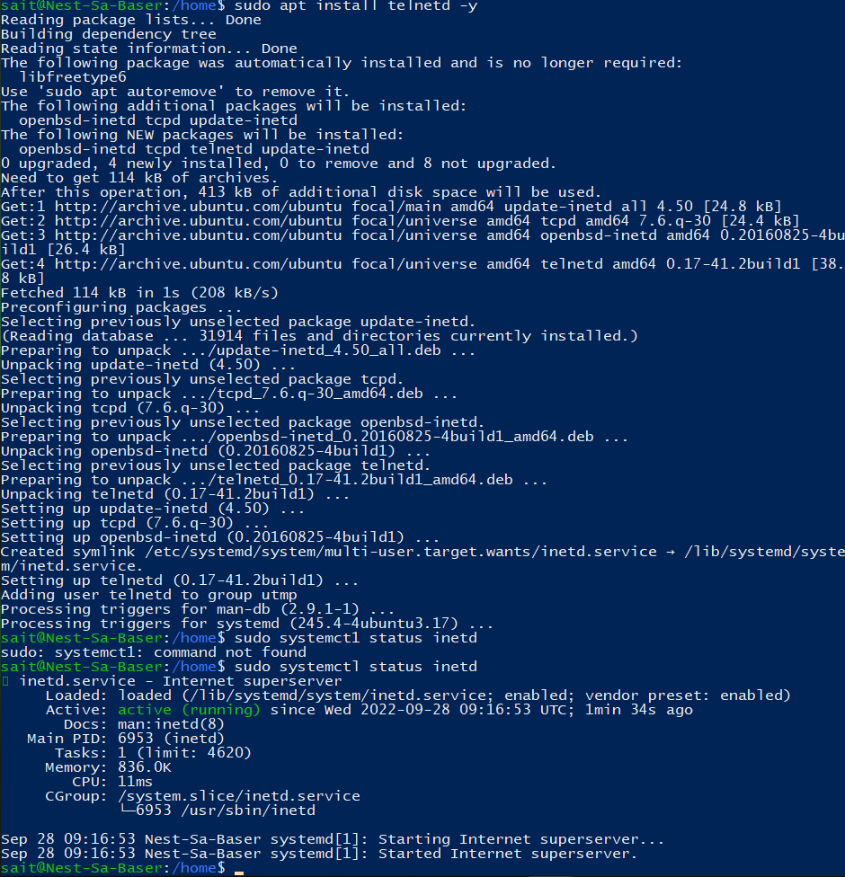

# LNX-06 Processes
Processes in Linux can be divided into three categories: Daemons, Services, and Programs.
A daemon runs in the background and is non-interactive. A Service responds to requests from programs. A service may be interactive. A program is run and used by users (e.g. Vim).

## Key terminology
**kill**: a command used to terminate a process.
**top**: a command used to show active processes and other system information. 
**apt-install**: command line used for installing packages.

## Exercise
- Start the telnet daemon.
- Find out the PID of the telnet daemon.
- Find out how much memory telnetd is using.
- Stop or kill the telnetd process

### Sources
https://www.linuxfoundation.org/blog/blog/classic-sysadmin-how-to-kill-a-process-from-the-command-line

https://www.digitalocean.com/community/tutorials/telnet-command-linux-unix

https://phoenixnap.com/kb/top-command-in-linux#:~:text=To%20run%20the%20top%20command,view%20using%20the%20available%20options.&text=The%20switch%20(%20%2D%20)%20and%20whitespace%20characters%20are%20optional.

https://www.howtoforge.com/how-to-install-and-use-telnet-on-ubuntu/

### Overcome challenges
I accidently typed 'sudo systemct**1** status inetd' instead of 'sudo systemct**l** status inetd'. It took me a while to realise why the command did not work.

### Results

We have to install telnet daemon before we can use it. We do this with "sudo apt install tenetd -y" (we use -y because the their will be question that asks for confirmation to install tenetd).

After it has finished installing telnet, we can confirm whether its running with '(sudo) systemctl status inetd'.
This also includes information about telnet's PID and how much memory telnetd is using (6953 and 836.0k in this case respectively).

With the "top -p 6953" command we can monitor the process ID.

We use 'sudo kill 6953' (6953 is the PID) to stop the telnetd process. We use "top -p 6953" again to confirm whether the process has actually stopped.
  
 