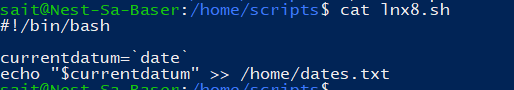
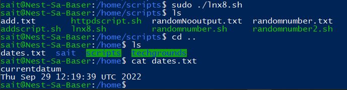
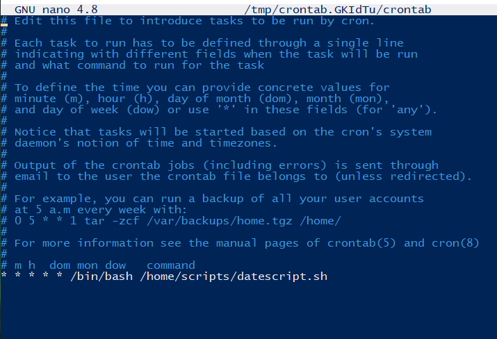
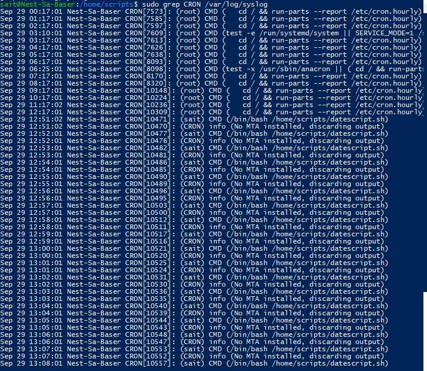
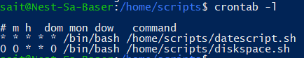
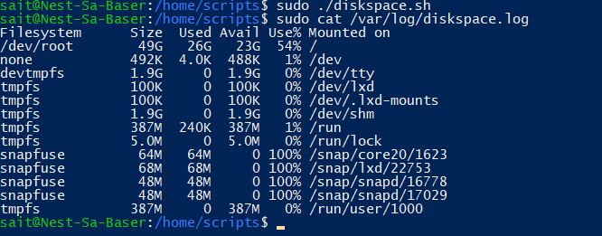

# Cronjobs
Cronjobs are a scheduld program that runs at a certain regulatr time of day or week. You can use cron jobs for anything that needs to be done periodically.
## Key terminology
**df -h**: stands for **d**isk **f**ree, the -h prints the disk information in human-readable format (K, G, M) 

## Exercise

- Create a Bash script that writes the current date and time to a file in your home directory.

- Register the script in your crontab so that it runs every minute.

- Create a script that writes available disk space to a log file in ‘/var/logs’. Use a cron job so that it runs weekly.

### Sources
https://www.cyberciti.biz/faq/unix-linux-getting-current-date-in-bash-ksh-shell-script/#:~:text=Sample%20shell%20script%20to%20display,scripts%20goes%20here%20%23%20...

https://linuxhint.com/date-command-bash/

https://www.cherryservers.com/blog/how-to-use-cron-to-automate-linux-jobs-on-ubuntu-20-04#:~:text=Cron%20is%20a%20Linux%20job,on%20a%20pre%2Dset%20schedule

https://askubuntu.com/questions/350861/how-to-set-a-cron-job-to-run-a-shell-script

https://www.howtogeek.com/409611/how-to-view-free-disk-space-and-disk-usage-from-the-linux-terminal/#:~:text=Bash%20contains%20two%20useful%20commands,terminal%20window%20to%20get%20started.

### Overcome challenges
[Give a short description of the challeges you encountered, and how you solved them.]

### Results
Here we've created our script that writes the current date and time to a file in your home directory.

If we run our script (make sure the file is executable with (chmod +x "filename.sh") we should get the current time as a result.

I have also "currentdatum" in the file, this is because I forgot to add "$" in the code. If you do not add the dollar sign, it will assume you want to print "currentdatum" instead of the variable "$currentdatum".

Next we have registered our script in the crontab so that it runes every minute.

With sudo grep CRON /var/log/syslog we can confirm that the script works.

This is our script that writes available disk space to a log file in '/var/log'

We have have also registered this script so that it runs weekly.

To confirm if our script works we can open the log file the script has actually created:

