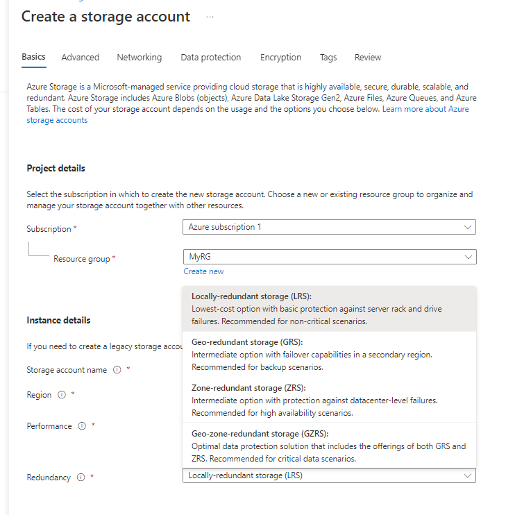
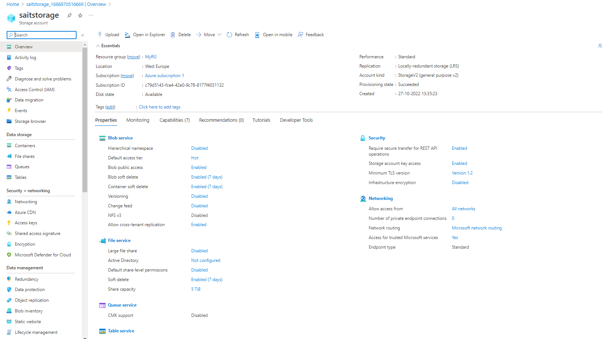
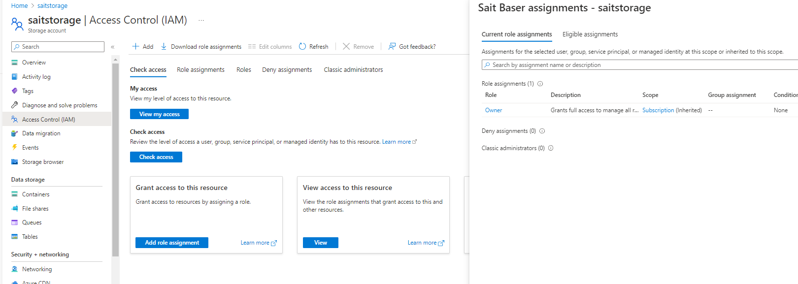
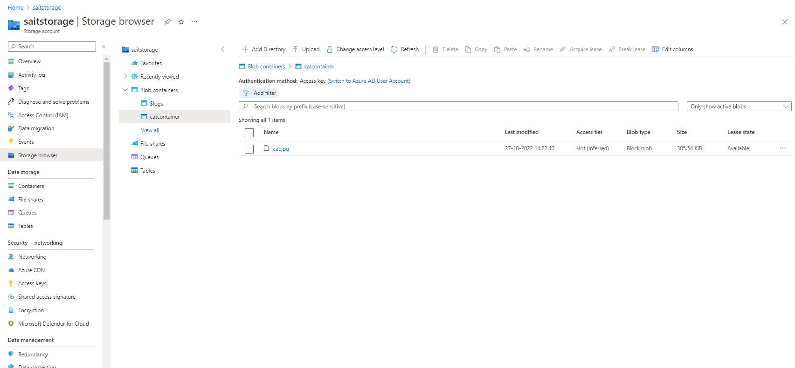
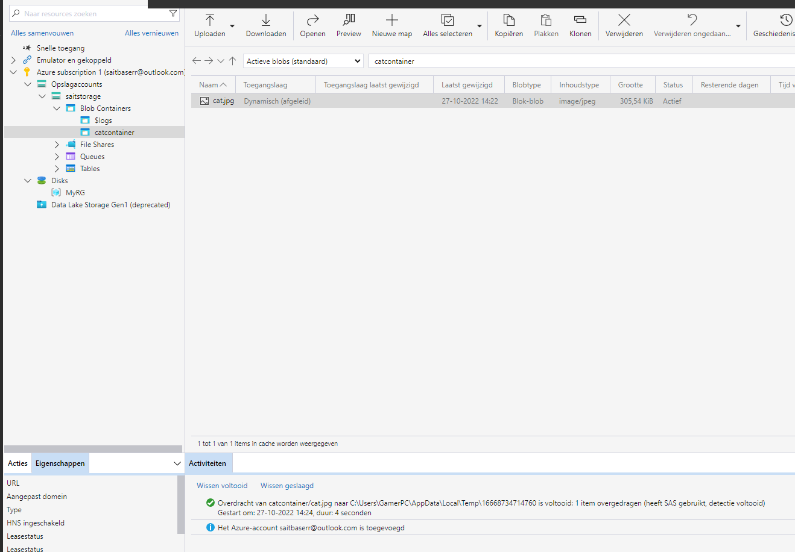

# Azure Storage Account

Om data op te slaan in Azure heb je een Azure Storage Account nodig. In een Storage Account staan alle Azure Storage data objects als blobs, files, disks en tables.

Data in een Storage Account is secure, highly available, durable en massively scalable. Alle data in een Storage Account is bereikbaar via het internet met HTTP en HTTPS. Omdat het makkelijk te bereiken is moet je goed opletten dat alleen de juiste identiteiten permissies hebben om bij de data te komen.

Azure Storage explorer is een gratis GUI om je data te beheren in Azure.

Veel IaaS en PaaS services van Azure maken ook gebruik van Azure Storage Accounts. 

## Key Terminologies

* Blob : Azure Blob storage is Microsoft's object storage solution for the cloud. 

## Exercise 1
- Maak een Azure Storage Account. Zorg dat alleen jij toegang hebt tot de data.
- Plaats data in een storage service naar keuze via de console (bijvoorbeeld een kattenfoto in Blob storage).
- Haal de data op naar je eigen computer door middel van de Azure Storage Explorer.

### Sources

* [Azure Storage](hhttps://learn.microsoft.com/en-us/azure/vs-azure-tools-storage-explorer-blobs)
* [Blob](https://learn.microsoft.com/en-us/azure/vs-azure-tools-storage-explorer-blobs)
* [Storage](https://learn.microsoft.com/en-us/azure/storage/blobs/storage-blobs-introduction/)

### Overcome challenges

 ### Results

