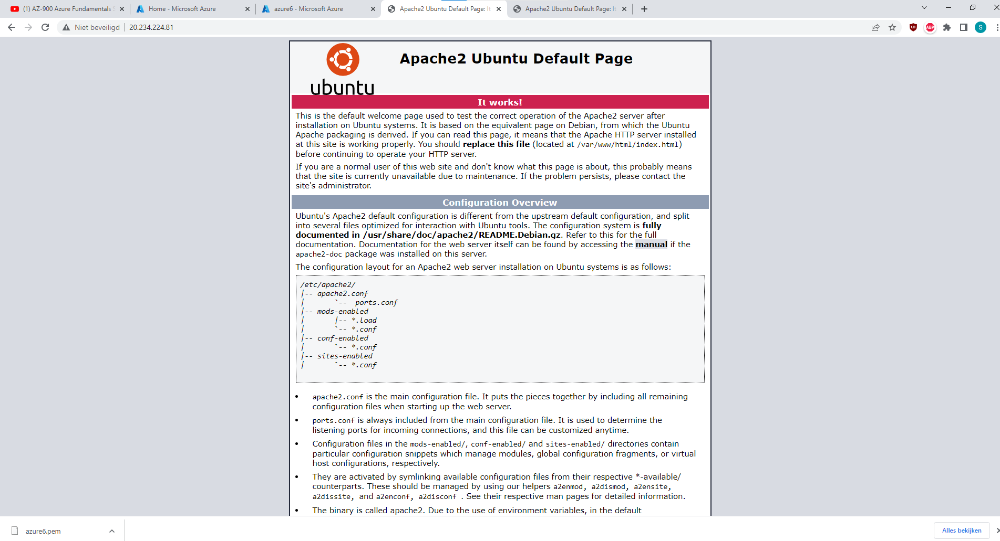

# Azure Virtual Machines

De Service waarmee je VMs kan maken in Azure heet (zeer toepasselijk) Azure Virtual Machines. Je kan deze VMs gebruiken voor alles waar je een fysieke server voor zou gebruiken. Omdat ze in een datacenter van Microsoft staan, kan je er alleen verbinding mee maken via het internet. Verbinding met een remote Linux-machine maak je met het Secure Shell (ssh) protocol. Voor een verbinding met Windows machines gebruik je het Remote Desktop Protocol (RDP).

## Key Terminologies

VM:

## Exercise 1
- Log in to your Azure Console.
- Create a VM with the following requirements:
    Ubuntu Server 20.04 LTS - Gen1
    Size: Standard_B1ls
    Allowed inbound ports:
    HTTP (80)
    SSH (22)
    OS Disk type: Standard SSD
    Networking: defaults
    Boot diagnostics are not required
    Custom data: 
        #!/bin/bash
    sudo su
    apt update
    apt install apache2 -y
    ufw allow 'Apache
    systemctl enable apache2
    systemctl restart apache2
- Verify that your server is working.

### Sources

* [VM](https://learn.microsoft.com/en-us/azure/virtual-machines/overview)
* [VM2](https://azure.microsoft.com/en-us/pricing/details/virtual-machines/linux/)

### Overcome challenges

 ### Results

