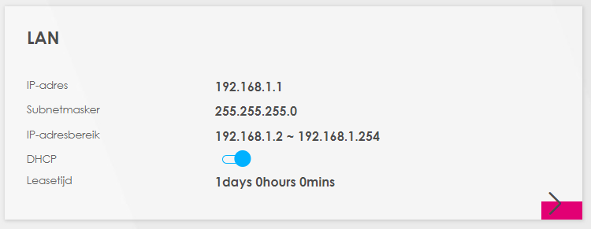
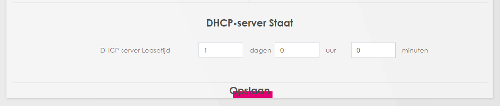

# NTW-02 Network Devices

## Key terminology
Router:
Switch:
Repeaters:
Access point: 
DHCP: 

## Exercise

- Benoem en beschrijf de functies van veel voorkomend netwerkapparatuur
- De meeste routers hebben een overzicht van alle verbonden apparaten, vind deze lijst. 
- Welke andere informatie heeft de router over aangesloten apparatuur?
- Waar staat je DHCP server op jouw netwerk? Wat zijn de configuraties hiervan?

### Sources
https://www.geeksforgeeks.org/layers-of-osi-model/?ref=lbp

Personal notes and summaries from school.

### Overcome challenges
[Give a short description of the challeges you encountered, and how you solved them.]

### Results
Benoem en beschrijf de functies van veel voorkomend netwerkapparatuur
- Router:

- Wifi repeater: 

De meeste routers hebben een overzicht van alle verbonden apparaten, vind deze lijst. Welke andere informatie heeft de router over aangesloten apparatuur?

We get this list when we type 192.168.1.1 in your webbrowser's search bar. You do need your admin credentials if you would like to acces this page. Depending on your router model, the admin user name and password are respectively admin admin, or "admin" '1234'. You will need to change the password after logging in with the default settings. If you have already logged on once but have forgot the password, you could just need to reset your router. This will also reset the wi-fi password to the default one (which you can find on your router). Depending on your router, you can go to the "Connected devices" page when you go to the **Status** page first. This page provides details about the connected devices. These information such as **IP adress**, **MAC adress**, and which device (**wifi-repeater** for example) they are connected to. 

Waar staat je DHCP server op jouw netwerk? Wat zijn de configuraties hiervan?

DHCP is usually on by default for everybody. The admin page on your **home router** should show whether DHCP is on or not. 

In this case we can see that is on, if we press the arrow it will take us to the DHCP configuration page which looks like this for me:.

Which translates to 1 day (24 hours). So basically you will get an IP address assigned by the router which your devices ''holds'' for 24 hours. If I connect with the same device to the same router 24 hours later, the router will assign a different IP address. This is usually not a problem, unless you use a program which ''hanteren'' a static IP address.  