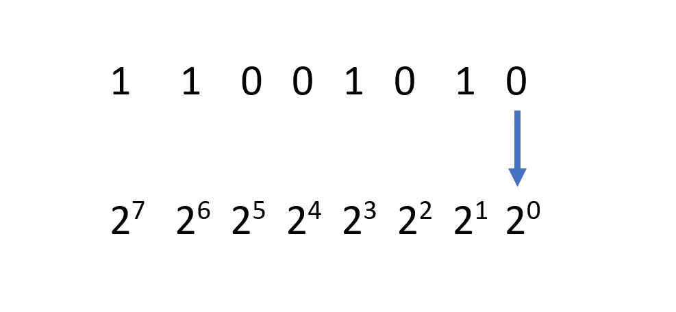
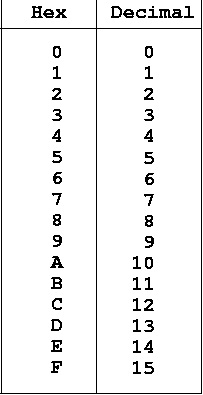
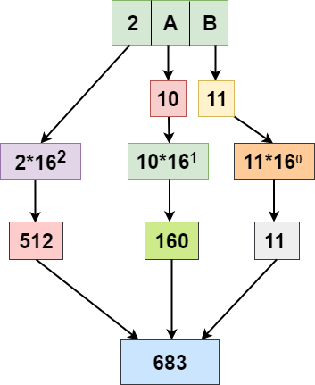

# NTW-04 Counting in Binary and Hex
A network protocol is an agreement about how to communicate. There are protocols on every layer of the OSI stack.

## Key terminology
Binary number: a number system that only uses 2 digits to represent numbers. 

Hexadecimal: a numeral system that uses base 16 

## Exercise
- Identify several other protocols and their associated OSI layer. Name at least one for each layer.
- Figure out who determines what protocols we use and what is needed to introduce your own protocol.
- Look into wireshark and install this program. Try and capture a bit of your own network data. Search for a protocol you know and try to understand how it functions.

### Sources
Notes from school, and online hex calculator to control the answers.

https://www.lifewire.com/how-to-read-binary-4692830

https://www.javatpoint.com/hexadecimal-to-decimal-in-c

### Overcome challenges
It has been a while since the last time I have counted in Binary and Hex. 

### Results

- Translate the following decimal numbers into binary:

16 = 23 = 0000 1000

128 = 25 = 0100 0000

228 = 27+26+25+23 = 1110 0100

112 = 26+25+24 = 0111 0000

73 = 26+23+20 = 0100 1001

- Translate the following binary numbers into decimal:

1010 1010 =  27+25+23+21 = 128 + 32 + 8 + 2 = 170

1111 0000 = 27+26+25+24 = 128 + 64 + 32 + 16 = 240

1101 1011 = 27+26+24+23+21+20  = 128 + 64 + 16 + 8 + 2 + 1 =  219

1010 0000 = 27+25 = 128 + 32 = 160

0011 1010 = 25+24+23+21 = 32 + 16 + 8 +2 = 58

- Translate the following decimal numbers into hexadecimal:

15 = F

37 = 2 * 16 + 5 = 25

246 = 15 * 16 + 6 = F6

125 = 7 * 16 + 13 = 7D

209 = 13 * 16 + 1 = D1

88 =  8 * 16 + 8 = 136

e0 =  14 * 16 + 0 = 224

cb = 12 * 16 + 11 = 203

2f = 2 * 16 + 15 = 47

d8 = 13 * 16 + 8 = 216