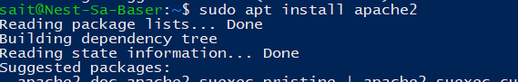
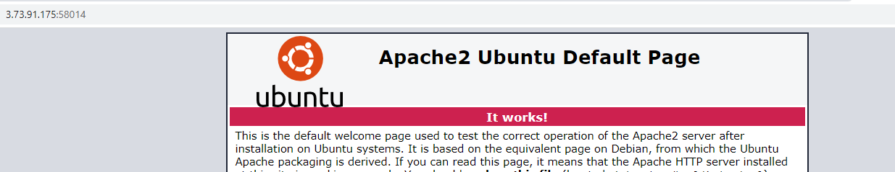
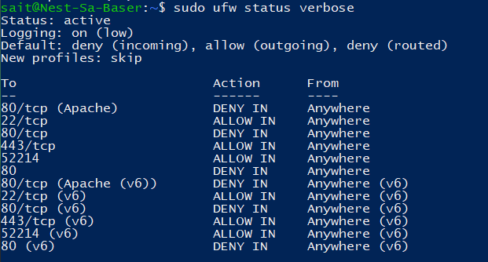
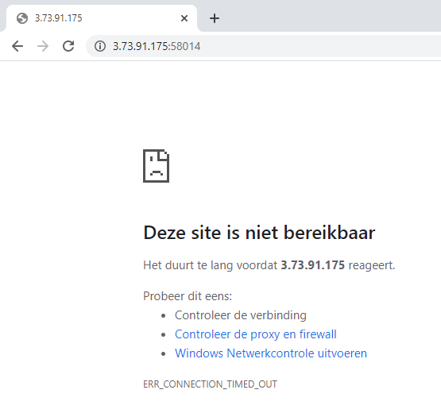

# SEC-02 Firewalls
Fire walls 

## Key terminology
**firewall**: basically a long wall around your network covered in doors. You could say that each door is a port. Each door has a number ()

**ufw**: **U**ncompicated **F**ire**w**all

**sudo ufc deny/allow "port"**: with this command we choose which port we allow or deny acces to our server. 

## Exercise
- Installeer een webserver op je VM.

- Bekijk de standaardpagina die met de webserver geïnstalleerd is.

- Stel de firewall zo in dat je webverkeer blokkeert, maar wel ssh-verkeer toelaat.

- Controleer of de firewall zijn werk doet.

### Sources
https://linuxize.com/post/how-to-setup-a-firewall-with-ufw-on-ubuntu-20-04/

https://www.digitalocean.com/community/tutorials/how-to-set-up-a-firewall-with-ufw-on-ubuntu-22-04

### Overcome challenges
I kept typing 'uf**c**' instead of ufw. Muscle memory which resulted in some of the commands not working. I should read the error messages often.

### Results
Install webserver:

The standard page on my server:

We have blocked webtraffic but allowed sshtraffic:

Which results in:

We should change the firewall settings back to the default settings:
with `sudo ufw reset` and/or `sudo ufw disable`. 

