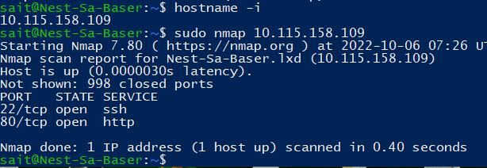

# SEC-01 Network detection
In order to prevent, stop or monitor attacks on a network you must be able to analyse your network. There are many tools available to do this, Nmap and Wireshark are very popular tools.

## Key terminology

**Network mapping**: a process used to discover all entities linked to a network.

**nmap**: short for  **N**etwork **Map**per. A Free and open source tool used for vulnerability checking, port scanning and networkmapping.

## Exercise
Scan the network of your Linux machine using nmap. What do you find?

Open Wireshark in Windows/MacOS Machine. Analyse what happens when you open an internet browser. (Tip: you will find that Zoom is constantly sending packets over the network. You can either turn off Zoom for a minute, or look for the packets sent by the browser between the packets sent by Zoom.)

### Sources

https://www.geeksforgeeks.org/nmap-command-in-linux-with-examples/

### Overcome challenges
Since wireshark gives you a lot of data it was hard to find the package we were looking for. TCP filters came in very useful.

### Results
nmap scan on local machine:

Wireshark result when visiting reddit.com

