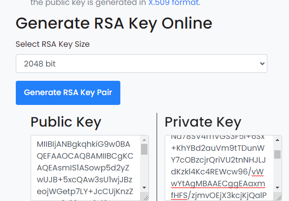
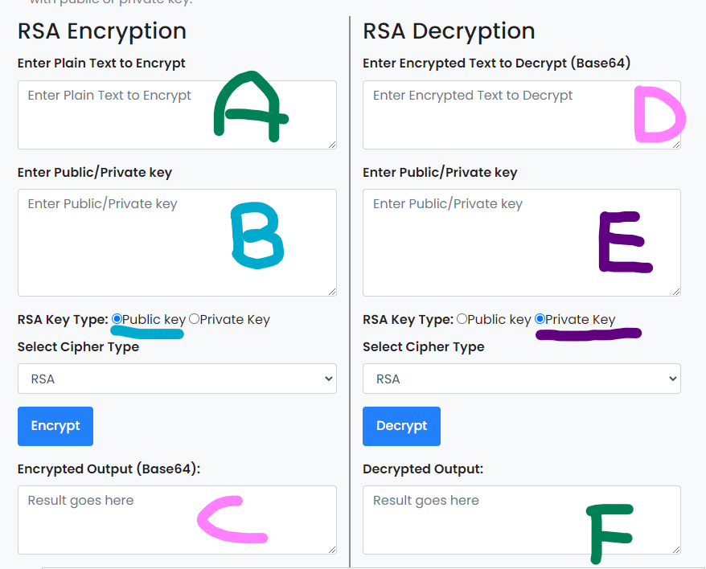
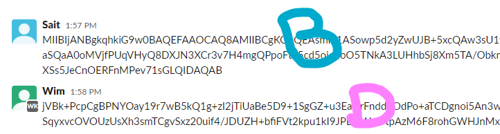
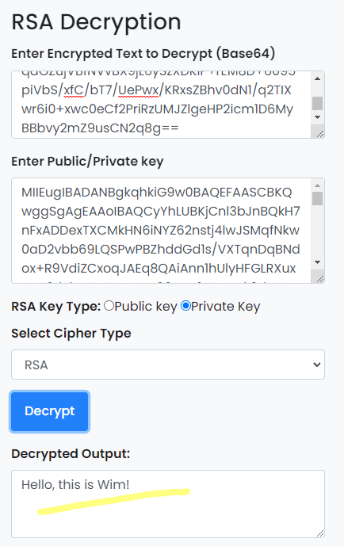

# Asymmetric encryption
Encryption is an important tool for securing data. Be it data at rest, or data in motion. A lot of what you do on your computer and the Internet is encrypted.

## Key terminology
Encryption:

Decryption:

RSA:

key: 

### Sources

https://www.youtube.com/watch?v=pArLLJmgX10&t=112s

### Overcome challenges

## Exercise
Generate a key pair.

Send an asymmetrically encrypted message to one of your peers via the public Slack channel. They should be able to decrypt the message using a key you share with them. The recipient should be able to read the message, but it should remain a secret to everyone else.

You are not allowed to use any private messages or other communication channels besides Slack. Analyse the difference between this method and symmetric encryption.

The website https://www.devglan.com/online-tools/rsa-encryption-decryption
allows us to generate a public and private key. Which is needed for the asyemmetrically ecrypted message.  

The (RSA) key size doesn't matter for this assignment. The recommended key size is 2048 for security reasons. For practising you should use lower bit size so that the keys are more readable. (takes less space in the chat when you are sharing public keys).  

With the private key, users can only encrypt plain text. To decrypt the encrypted message, you need the private key. Which means that the user with the private key is the only one who can decrypt these messages (which are encrypted with the public key) in this case.  

A = is the field suggest, plain text, this is were user1 writes his message.

B = the public key which we created in the first image. This key is available and needed for everyone that wants to send you a secret message.

C = The encrypted output which the user filled in A. 

D = The encrypted output (which is the decrypters input).

E = The private key which shouldn't be available to others, otherwise you might aswell us the standard encryption/decryption method. 

F= if field B & E were filled correctly you should get the decrypted message in this field (obviously the same as field A). 

So if you only send the public key, other users can send you encrypted messages which you can decrypt:

which resulted in: 

