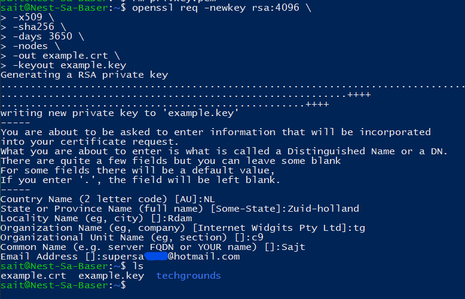
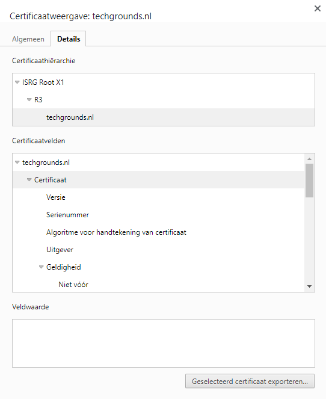
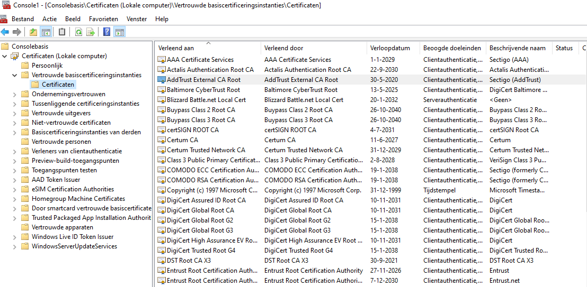
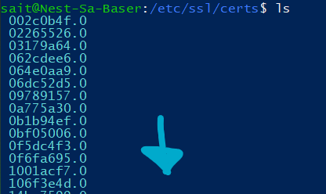

# Public Key Infrastructure

## Key terminology
SSL:

certlm.msc: command to see certificates for the local device.

## Exercise
- Create a self-signed certificate on your VM.
- Analyze some certification paths of known websites (ex. techgrounds.nl / google.com / ing.nl).
- Find the list of trusted certificate roots on your system (bonus points if you also find it in your VM).

### Sources

https://linuxize.com/post/creating-a-self-signed-ssl-certificate/

https://www.keyfactor.com/resources/how-to-check-ssl-certificate/#:~:text=To%20check%20an%20SSL%20certificate,information%20related%20to%20the%20certificate.

https://learn.microsoft.com/en-us/dotnet/framework/wcf/feature-details/how-to-view-certificates-with-the-mmc-snap-in

https://devopscube.com/create-self-signed-certificates-openssl/

### Overcome challenges
What "\" is.

### Results

Self-signed certficate:

Certification of techgrounds.nl

List of certificates on my system:

List of certs in VM

