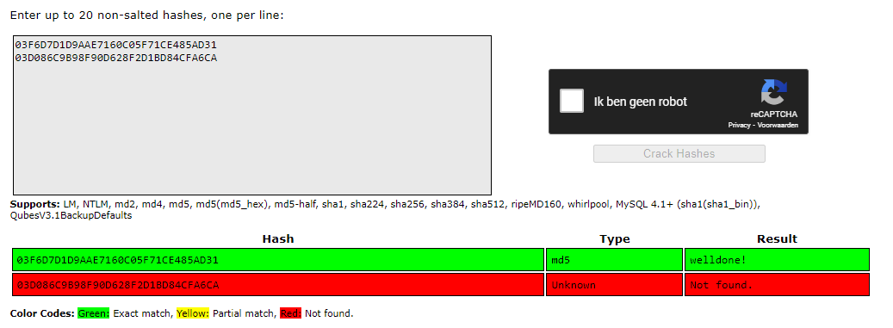

# Passwords
In terms of factors of authentication, passwords fall into the ‘something you know’ category.
On the front-end, passwords can be guessed. This can be made harder with the following strategies:
	- Not using common passwords
	- Using longer passwords
	- Using special characters like @,*,%, etc.
	- Using a mixture of CAPITAL and small letters
	- Not using easily deducible passwords like birthdates or pet names
	- Using a different password for every login
	- Using a sentence
    - Using a riddle
    - Using a whole story summarized in 1 sentence.

## Key terminology
Hash:

Salt:

## Exercise
- Find out what hashing is and why it is preferred over symmetric encryption for storing passwords.
- Find out how a Rainbow Table can be used to crack hashed passwords.
- Below are two MD5 password hashes. One is a weak password, the other is a string of 16 randomly generated characters. Try to look up both hashes in a Rainbow Table.
03F6D7D1D9AAE7160C05F71CE485AD31
03D086C9B98F90D628F2D1BD84CFA6CA
- Create a new user in Linux with the password 12345. Look up the hash in a Rainbow Table.
Despite the bad password, and the fact that Linux uses common hashing algorithms, you won’t get a match in the Rainbow Table. This is because the password is salted. 
- To understand how salting works, find a peer who has the same password in /etc/shadow, and compare hashes.

### Sources
https://www.encryptionconsulting.com/education-center/encryption-vs-hashing/

https://auth0.com/blog/adding-salt-to-hashing-a-better-way-to-store-passwords/

https://www.thesslstore.com/blog/difference-encryption-hashing-salting/

https://linux-audit.com/password-security-with-linux-etc-shadow-file/

### Overcome challenges
[Give a short description of the challeges you encountered, and how you solved them.]

### Results

Find out what hashing is and why it is preferred over symmetric encryption for storing passwords.

> Encryption is a two-way function where data is passed as plaint text and comes out as ciphertext. This message can be decrypted. 

>Hashing is the process of converting data (key) in to another value. A hash function is used to create the new value. The result is called a *hash*. To reverse this process it would take a lot of time. 
>The problem is if we use the same data in 1 key and the same data in the 2nd key, they will generate the same value.
>Hashing is practically a one-way function and if salted, it would take all the best computers a very long time to reverse the hash.

A rainbow table itself is a precomputed table that contains the password hash value for each plain text character used during an authenication process. (*Salting* has made the rainbow table useless for hackers). 

Here we have created a new user in our VM with the password 12345. After the user is created we grep the user's info from the shadow folder with one command.

This evidently didn't work with the rainbowtable because the hash is salted.

