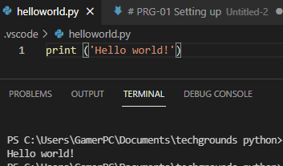

# PRG-01 Setting up
- Install the latest version of Python from https://www.python.org/
- Install VS Code from https://code.visualstudio.com/download
- Install the Python plug-in in VS Code.
- Write the following Python code. The output in the terminal should be the text “Hello world!


## Python plugin


## Hello World!
```Python
print('Hello World!')
```


