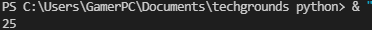
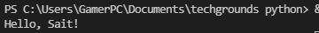
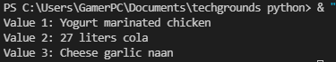

# Variables
A variable can store a value. This value can then be accessed with the variable name in the code. This is useful if you want to use one value multiple times, or if you want to dynamically change the value.
# Excercise 1
## Code
```python
x = 10
y = 15
z = (x+y)
print(z)
```
## Result


# Excercise 2
## Code
```python
name = 'Sait'
print('Hello, ' + name + '!')
```
## Result


# Excercise 3
## Code 
```python
Value_1 = "Yogurt marinated chicken"
Value_2 = "27 liters cola"
Value_3 = "Cheese garlic naan"
print("Value 1:", Value_1)
print("Value 2:", Value_2)
print("Value 3:", Value_3)
```
## Result
