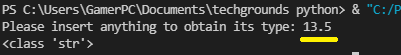

# Data types and comments

# Excercise 1
- Create a new script.
- Copy the code below into your script.
```python
a = 'int'
b = 7
c = False
d = "18.5"
```
- Determine the data types of all four variables (a, b, c, d) using a built in function.
- Make a new variable x and give it the value b + d. Print the value of x. This will raise an error. Fix it so that print(x) prints a float.
- Write a comment above every line of code that tells the reader what is going on in your script.


## Code
```python
a = 'int'    #these values were given in the excercise
b = 7
c = False
d = "18.5"

print("a is", type(a))  # here we print the data types for each variable.
print("b is", type(b))
print("c is", type(c))
print("d is", type(d))

x = b + float(d) #the error is raised because 'd' is a string, float() geeft de parameter waarde terug als float.
print(x)  
```
## Result


# Excercise 2
- Create a new script.
- Use the input() function to get input from the user. Store that input in a variable.
- Find out what data type the output of input() is. See if it is different for different kinds of input (numbers, words, etc.)
## Code
```python
variable = input("Please insert anything to obtain its type: ")
print(type(variable))
```
## Result




We can see that no matter the input, the data out will always be a string.

