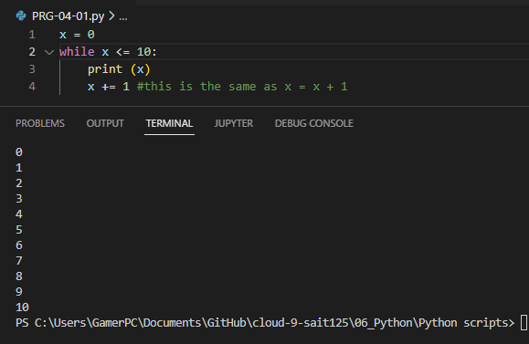
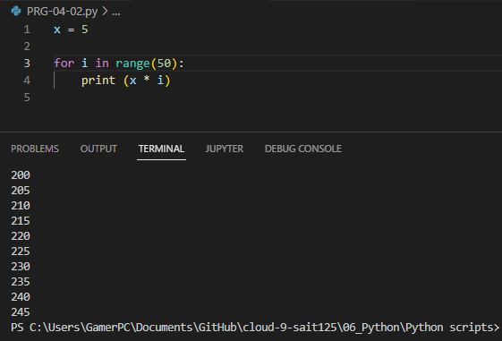
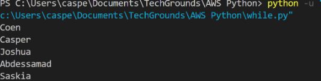
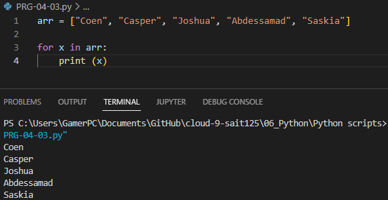

# Loops
You can use loops when you want to run a block of code multiple times. For example, you might want to do an operation on every item in a (large) list, or you want to write an algorithm that follows the same set of instructions for multiple iterations.
# Excercise 1
- Create a new script.
- Create a variable x and give it the value 0.
- Use a while loop to print the value of x in every iteration of the loop. After printing, the value of x should increase by 1. The loop should run as long as x is smaller than or equal to 10.

## Code
```python
x = 0
while x <= 10: #while x is lower than or equal to 10, print value and add 1 more.:
    print (x)
    x += 1 #this is the same as x = x + 1
    
    
```
## Result

# Excercise 2

Print the value of i in the for loop. You did not manually assign a value to i. Figure out how its value is determined.
Add a variable x with value 5 at the top of your script.
Using the for loop, print the value of x multiplied by the value of i, for up to 50 iterations.

## Code
```python
x = 5

for i in range(50):
    print (x * i) 
```
## Result


# Excercise 3
Create a new script.
Copy the array below into your script.
```python
arr = ["Coen", "Casper", "Joshua", "Abdessamad", "Saskia"]
```
arr = ["Coen", "Casper", "Joshua", "Abdessamad", "Saskia"]
Use a for loop to loop over the array. Print every name individually.
Example output:

## Code 
```python
arr = ["Coen", "Casper", "Joshua", "Abdessamad", "Saskia"]

for x in arr:
    print (x)
```
## Result
