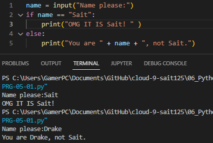
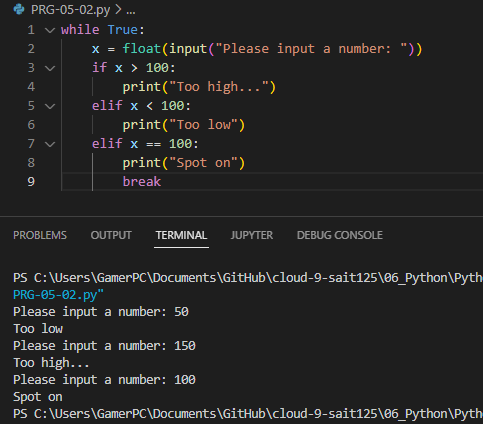

# Conditions
Very often, you will want to run a piece of code only when certain conditions are met. For example, you might want to write something to an error log only if an error occurred.
Python makes use of the if, elif, and else statements.
# Excercise 1
- Create a new script.
- Use the input() function to ask the user of your script for their name. If the name they input is your name, print a personalized welcome message. If not, print a different personalized message.
## Code
```python
name = input("Name please:") #asks for input 
if name == "Sait":  # if the variable "name" is equal to Sait, print the following:
    print("OMG IT IS Sait! " )
else: #if not, print the following:
    print("You are " + name + ", not Sait.") 
```
## Result

# Excercise 2
- Create a new script.
- Ask the user of your script for a number. Give them a response based on whether the number is higher than, lower than, or equal to 100.
- Make the game repeat until the user inputs 100.

## Code
```python
while True:
    x = float(input("Please input a number: "))
    if x > 100:
        print("Too high...")
    elif x < 100:
        print("Too low")
    elif x == 100:
        print("Spot on")
        break
```
## Result

