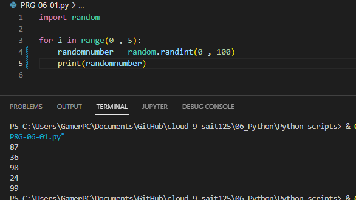
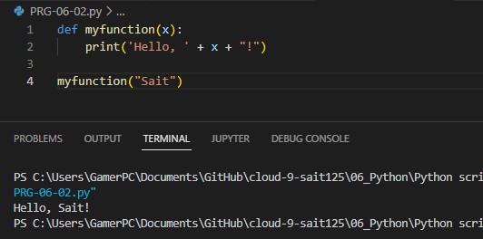
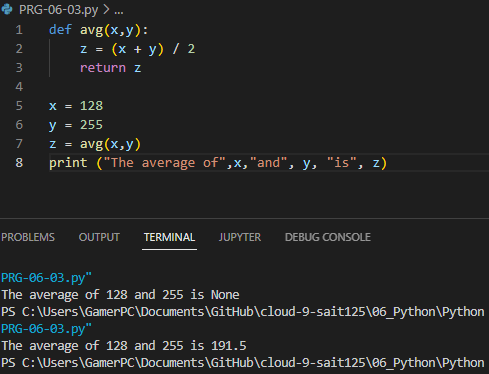

# Functions
A function is a block of code which only runs when it is called.

You can pass data, known as parameters, into a function.

A function can return data as a result.
# Excercise 1
- Create a new script.
- Import the random package.
- Print 5 random integers with a value between 0 and 100.

## Code
```python
import random

for i in range(0 , 5): #loop 5 times
    randomnumber = random.randint(0 , 100) #variable = random number between 0-100
    print(randomnumber) 
```
## Result


# Excercise 2
- Create a new script.
Write a custom function myfunction() that prints “Hello, world!” to the terminal.
- Call myfunction.
- Rewrite your function so that it takes a string as an argument. Then, it should print “Hello, [string]!”.

## Code
```python
def myfunction(x):
    print('Hello, ' + x + "!")

myfunction("Sait")  
```

## Result

# Excercise 3
Create a new script.
Copy the code below into your script.
```python
def avg():
    # write your code here
 
x = 128
y = 255
z = avg(x,y)
print ("The average of",x,"and", y, "is", z)
```
Write the custom function avg() so that it returns the average of the given parameters.


## Code
```python
def avg(x,y):
    z = (x + y) / 2
    return z #a function does not always have to have an explicit return statement. If the function doesn’t need to provide any results to the calling point, then the return is not needed.

x = 128
y = 255
z = avg(x,y)
print ("The average of",x,"and", y, "is", z)
```
## Result
